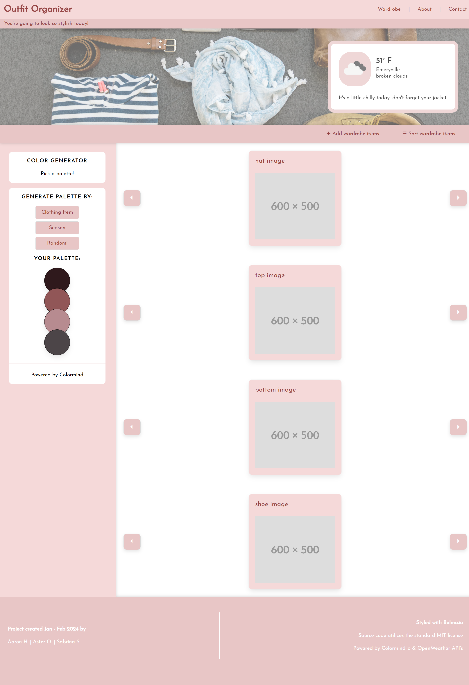

# Outfit-Organizer

## Project Description

This project was created as the first group project for the UC Berkeley Coding Bootcamp. We set out to create an application that can help the user pick which outfit to wear each day. The application includes a widget powered by the Weather API displaying the weather at the user's location, to help the user dress accordingly. The application includes a color palette generator powered by the Colormind API, to offer the user inspiration when picking an outfit.

## Contents

- [Problem](#problem)
- [Solution](#solution)
- [Deployment](#deployment)
- [Collaborators](#collaborators)
- [Resources](#resources)
- [License](#License)

## Problem

- This project was conceptualized and built from scratch. Here are the requirements given by the client:
- Use a CSS framework other than Bootstrap.
- Be deployed to GitHub Pages.
- Be interactive (in other words, accept and respond to user input).
- Use at least two server-side APIsLinks to an external site..
- Include at least one modal, and does not use native browser alert, confirm, or prompt functionality.
- Use client-side storage to store persistent data.
- Be responsive.
- Have a polished UI.
- Have a clean repository that meets quality coding standards (file structure, naming conventions, best practices for class/id naming conventions, indentation, quality comments, and so on).
- Have a quality README (including a unique name, description, technologies used, screenshot, and link to the deployed application).

See below for a mockup designed by Aster Oliva in Figma

## Solution

We rectified the above problems in the following way:

- As a group, we delegated tasks based on our individual strengths as developers.
- Sabrina was assigned the task of building the HTML and linking Bulma to the project.
- Aaron was handled the backend JavaScript development and integration to the frontend.
- Aster designed and mocked-up the projects UI, working primarily with CSS & HTML to build the project frontend with Bulma.
- Some features were unable to be completed due to time constraints and life events, features that were temporarily shelved to prioritized MVP completion include:
  - A collapsible sidebar
  - Filtering wardrobe items
  - Adding separate pages for navigation items
  - Full Colormind integration to the sidebar buttons
  - A method of cropping user images to keep image dimensions from affecting the layout

See below for a screenshot of the project.

## Deployment

[Link to the GitHub repo for this project](https://github.com/Sabrinasaunders/outfit-organizer)

[Link to the deployed project on GitPages](https://Sabrinasaunders.github.io/outfit-organizer)

## Collaborators

This project was a collaboration between Aaron Ho, Aster Oliva, and Sabrina Saunders.

## Resources

See the links below to see some of the resources that were used for this project:

[Bulma CSS Framework](https://bulma.io/documentation/overview/start/)

[Weather API](https://openweathermap.org/api)

[Colormind API](http://colormind.io/)

[Figma Wireframing Tool](https://www.figma.com/)

[Google Fonts](https://fonts.google.com/)

## License

This project utilizes the standard MIT License.
